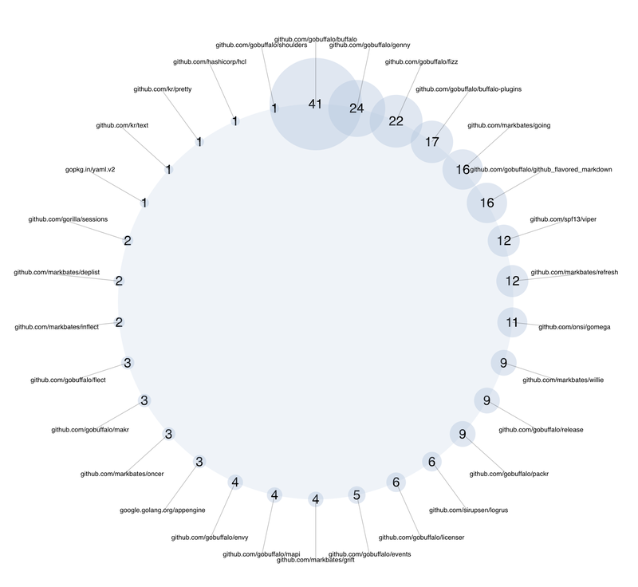
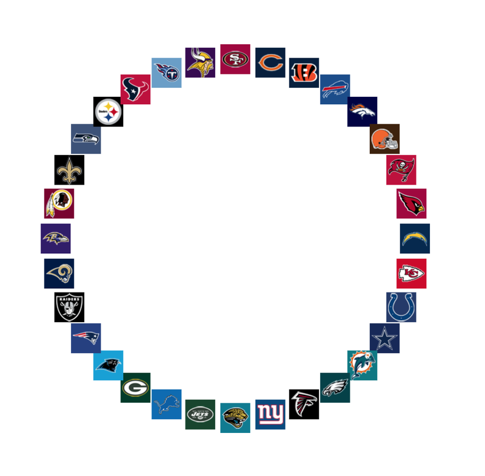

# Radial: radial visualization



```radial``` reads tab-separated name,values pairs from standard input, creates a radial layout.
The values are shown portportially as bubbles around the circle.  The output is SVG to the standard output.

Specifying the ```-image``` option interprets the names in the input as image file names,
and shows the images instead of the value bubbles.



## Options

```
  -bg string
    	background color (default "white")
  -bmax float
    	bubble max (default 70)
  -bmin float
    	bubble min (default 7)
  -color string
    	bubble color (default "lightsteelblue")
  -fg string
    	text color (default "black")
  -fs float
    	font size (default 10)
  -height float
    	canvas height (default 1000)
  -image
    	names are image files
  -op float
    	opacity percentage (default 40)
  -r float
    	radius percentage (default 30)
  -title string
    	title
  -width float
    	canvas width (default 1000)
```